# Writeup on Sensor Fusion Projects on 3D Object Detection and Tracking Over Time
This writeup documents the results of the student tasks both from the Mid-Term Project on 3D Object Detection and from the Final Project on Sensor Fusion and Object Tracking of the Sensor Fusion course in Udacity's Self-Driving Car Engineers Program.

## Mid-Term Project: 3D Object Detection
The Mid-Term Project focuses on detecting objects in 3D using lidar measurements. By evaluating range, bearing and intensity information from the first order lidar response one can obtain range images (frontal projection) or a birds eye view (BEV) map of the lidar points. The bird's eye view (BEV) map is fed to an object detector (e.g. a deep convolutional neural network), which has been trained to 3D detect objects from such lidar BEV maps. For each detected object, the object detector predicts a 3D bounding box given by the x-y-z-coordinates of the box center position, the yaw (resp. orientation) angle, as well as the length, width and height of the 3D bounding box. The following documentation shows example plots generated by the implemented visualization functions in the code.

### Step 1: Compute Lidar Point-Cloud from Range Image

#### Visualize Lidar range image (ID_S1_EX1)
In fig. 1.1 and 1.2 you can see a 360° surround view and a symmetric +/-90° center crop of the stacked range and intensity channels of the lidar range image of the first lidar frame in sequence 1 (1005081002024129653_5313_150_5333_150). The elongation channel, which represents the range elongation of the range measurement (resp. the delta) due to the Doppler effect of the ego car's own motion, is not visualized here. The range image is derived from the 3D point cloud of the first return response of the lidar signal. The range channel shows the distance measurements obtained from measuring runtime of the lidar signal. It is normalized over the full range of the distance measurement distribution and scaled to an 8-bit representation. The intensity channel shows the remaining intensity of the lidar response. It is normalized here with respect to the 1...99 percentile range of the received intensity distribution and scaled to an 8-bit representation in order to mitigate the effect of outliers with very high or very low intensity on the recognizability of the intensity channel contents.

*Fig. 1.1.1: 360° surround view of shape (128, 2650) of the 8-bit lidar range image of frame 0 from sequence 1 (1005081002024129653_5313_150_5333_150) looking in driving direction showing the stacked range channel (top) and intensity channel (bottom)*

*Fig. 1.1.2: Symmetric +/-90° center crop of shape (128, 1324) from 360° surround view of the 8-bit lidar range image of frame 0 from sequence 1 (1005081002024129653_5313_150_5333_150) looking in driving direction showing the stacked range channel (top) and intensity channel (bottom)*

#### Visualize Lidar point-cloud (ID_S1_EX2)
With the help of a 3D viewer based on Open3D library one can step through the lidar frames of the test sequences. In the following, we inspect the lidar point-clouds of different frames from sequence 3 (10963653239323173269_1924_000_1944_000) in order to locate vehicles with varying degrees of visibility. This way, one can get a feeling for stable features of vehicles (e.g. rear-bumper, tail-lights, ...), which are quite well recognizable in the lidar point-cloud, and rather instable features (e.g. glas windows, filigrane structures like a railing on the roof, ...), which are harder to recognize as they are only marked with very few lidar points.

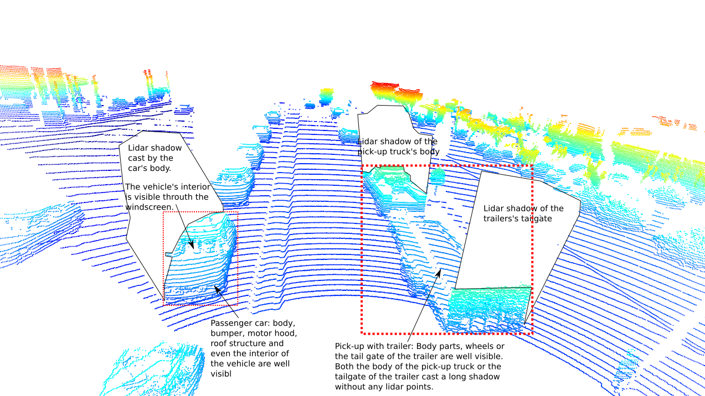

*Fig. 1.2.1: 3D view of the lidar point cloud of frame 0 in sequence 3 (10963653239323173269_1924_000_1944_000) - front view in driving direction: The body parts of the vehicles are very well depicted in the 3D point cloud. The transparent windows even allow a glimpse into the interior of the cabins. The tailgate of the pickup truck's trailer as well as the cars themselvs cast a shadow behind them which is invisible for the lidar.*

*Fig. 1.2.2: 3D view of the lidar point cloud of frame 0 in sequence 3 (10963653239323173269_1924_000_1944_000) - rear view sidewards to the right: Vehicles partially occluded by other objects like another vehicle in front are not fully visible. Occlusions make it more difficult to detect objects correctly as some relevant information about the object's contour or size is missing, for example.*

*Fig. 1.2.3: 3D view of the lidar point cloud of frame 0 in sequence 3 (10963653239323173269_1924_000_1944_000) - front view sidewards to the left: The contours of vehicle cabins including the wheels are usally well recognizable in the lidar point cloud. Car windows are transparent for the lidar signal. They do not reflect the light back to the sensor in most cases. There is a blind zone around the ego vehicle due to a limitation of the lidar sensor's field of view and due to occlusion of the ego vehicles body itself. If an object enters this zone the parts in this blind zone are clipped off, or truncated, respectively.*

*Fig. 1.2.4: 3D view of the lidar point cloud of frame 50 in sequence 3 (10963653239323173269_1924_000_1944_000) - rear view sidewards to the left. If the vehicles are close details of the wheels and wheel houses are depictable by the lidar. Even filigrane structures on the roof are detectable but this is rather hard due to the low number of lidar points on such small-sized objects.*

*Fig. 1.2.5: 3D view of the lidar point cloud of frame 90 in sequence 3 (10963653239323173269_1924_000_1944_000) - rear view: If a vehicle is not too fare away, it is even possible to see the side mirrors of cars in the lidar point cloud. The contour of head lights is also visible in some cases, but the head lights themselves appear as empty fields as the lidar signal does not return to the sensor.*

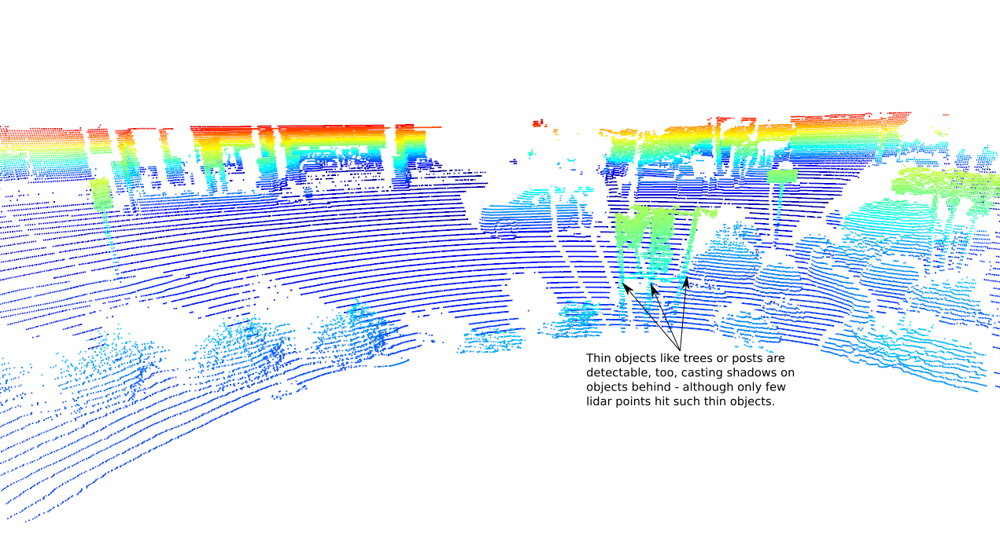

*Fig. 1.2.6: 3D view of the lidar point cloud of frame 100 in sequence 3 (10963653239323173269_1924_000_1944_000) - side view to the right. Other objects like trees cast a shadow onto other objects behind. In this case the vehicle behind the trees is cut into multiple parts. If such occlusions are only small, this should not affect detectability too badly.*

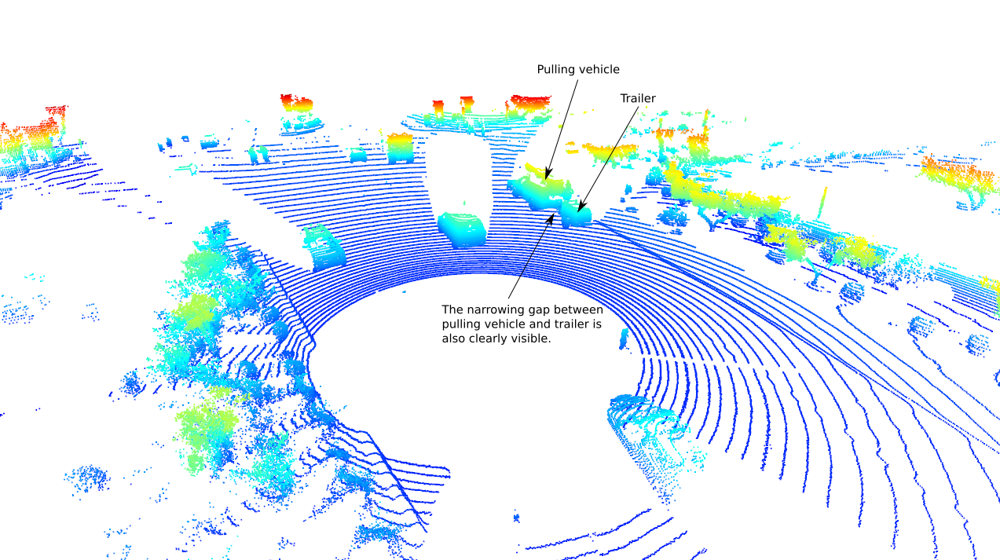

*Fig. 1.2.7: 3D view of the lidar point cloud of frame 120 in sequence 3 (10963653239323173269_1924_000_1944_000) - front view in driving direction: In case of vehicles with trailers both objects are usually well visible as they have larger plain surface parts that scatter light back to the lider sensor. The narrowing or gap between the pulling vehicle and the trailer is visible, too, if not occluded by another object or the trailer itself.*

*Fig. 1.2.8: 3D view of the lidar point cloud of frame 150 in sequence 3 (10963653239323173269_1924_000_1944_000)- rear view: If a vehicle is not too far away, it is possible to recognize the side mirrors of the vehicles in the lidar point cloud - even if they are quite small.*

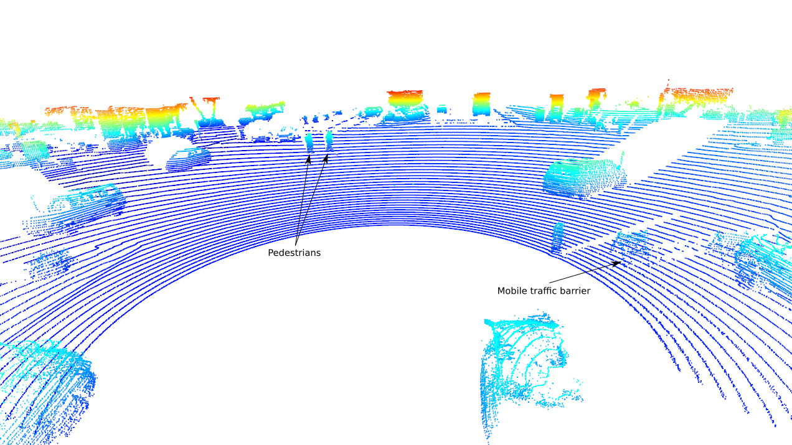

*Fig. 1.2.9: 3D view of the lidar point cloud of frame 190 in sequence 3 (10963653239323173269_1924_000_1944_000) - front view in driving direction and to the sides: Pedestrians or filigrane objects like mobile traffic barriers are recognizable in the lidar point cloud, too.*

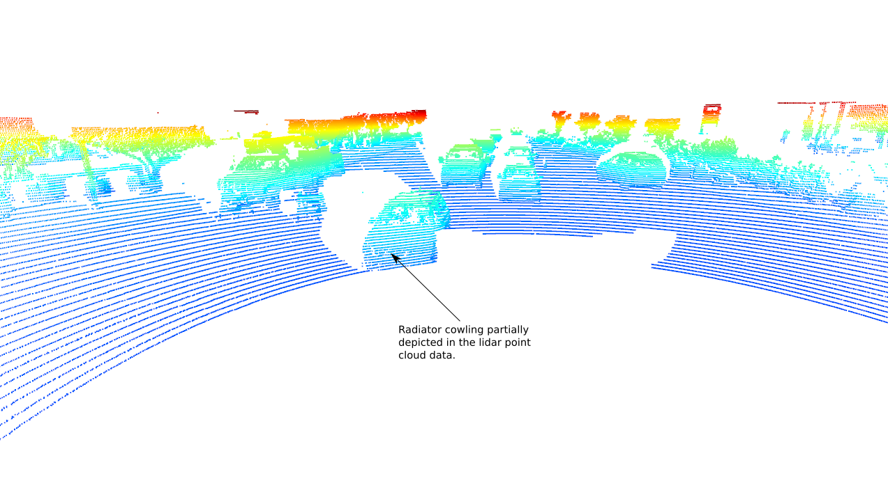

*Fig. 1.2.10: 3D view of the lidar point cloud of frame 190 in sequence 3 (10963653239323173269_1924_000_1944_000) - rear view: Close by objects near the blind zone of the lidar sensor usually show the best depiction in the 3D point cloud as they are rastered by a very high point density, which allows a good resolution of even filigrane structural parts like side mirrors or parts of the radiator cowling.*

-Conclusions:-
* Larger plain parts of the autobody like the rear bumpers or the cabin itself with surface normals pointing in lidar signal direction or with surface normals pointing in an angle smaller than 90° with respect to the lidar signal direction are usually well depicted in the lider point cloud if their surfaces do not absorb the lidar signal, but scatter it in back in all directions.
* Fully reflective surfaces, would only be well visisble if the light returns to the lidar sensor, but invisibile if the lidar signal is mirrored in another direction where it never reaches the lidar sensor again. An example would be the head lights of cars.
* Transparent objects like the windows of a car let the lidar light pass through without throwing it back to the lidar sensor. Therefore, they are usually not visible as solid objects in the lidar point cloud.
* As each object throws a shadow zone which is invisible for the lidar sensor, objects in front of other objects occlude the objects behind them depending on the viewing direction. This also applies for the ego vehicle contour itself, which can cast additional blind zones into the lidar field of view depending on the mounting position and the overall lidar field of view.

### Step 2 : Create Birds-Eye View from Lidar PCL

#### Convert sensor coordinates to BEV-map coordinates (ID_S2_EX1)
The goal of this task is to perform the first step in creating a birds-eye view (BEV) perspective of the lidar point-cloud. Based on the (x,y)-coordinates in sensor space, you must compute the respective coordinates within the BEV coordinate space so that in subsequent tasks, the actual BEV map can be filled with lidar data from the point-cloud.

A description of all required steps can be found in the code, s. [objdet_pcl.py](student/objdet_pcl.py).

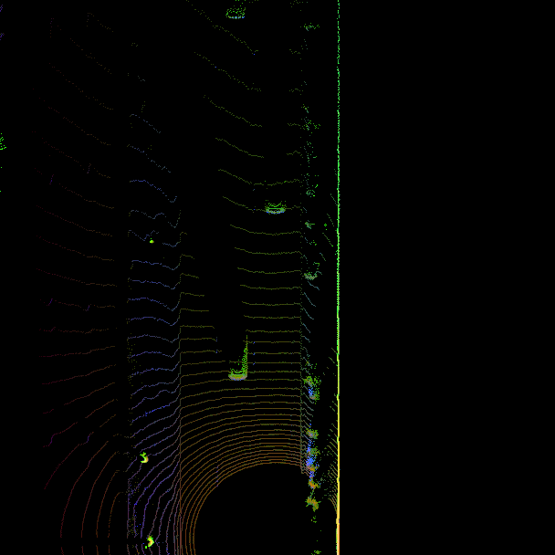

*Fig. 2.1.1: Bird's eye view map of the 3D lidar point cloud with a 360° surround view around the ego vehicle.*

#### Compute intensity layer of the BEV map (ID_S2_EX2)
The goal of this task is to fill the "intensity" channel of the BEV map with data from the point-cloud. Therefore, all points with the same (x,y)-coordinates within the BEV map are identified, and then, the intensity value of the top-most lidar point is associated to the respective BEV pixel. The resulting list of points is named 'lidar_pcl_top' as it will be re-used in later tasks. In order to identify the point with the same (x,y)-coordinates and to find the topmost z-coordinate, sorting of the point cloud is required. The sorting is performed using numpy.lexsort) in such a way that first, all points are sorted according to their x-coordinate in BEV space. Then, for points with the same x-coordinate, sorting is again performed by their y-coordinates in BEV space. In case there are points with both x and y identical, the points are sorted in descending order by their z-ccordinate in sensor space. As numpy.lexsort sorts in ascending order by default, the sorted squence needs to be inverted to obtain a sorting in descending order for z-ccordinates in each (x,y)-cell. Afterwards, the topmost point can be picked. In order to ensure that the influence of outlier values (very bright and very dark regions) is sufficiently mitigated and objects of interest (e.g. vehicles) are clearly separated from the background (intensity distribution on vehicles should neither be close to zero nor clipped at 255), normalization is applied to the sorted point cloud.

A description of all required steps can be found in the code, s. [objdet_pcl.py](student/objdet_pcl.py).

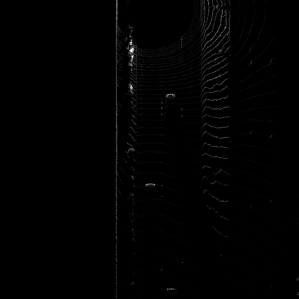

*Fig. 2.2.1: Intensity channel of the bird's eye view map of the 3D lidar point cloud with a 360° surround view around the ego vehicle.*

#### Compute height layer of the BEV map (ID_S2_EX3)
The goal of this task is to fill the "height" channel of the BEV map with data from the point-cloud. Therefore, the sorted and pruned point-cloud lidar_pcl_top from the previous task is used normalizing the height in each BEV map pixel by the difference between max. and min. height as is defined in the configs structure.

A description of all required steps can be found in the code, s. [objdet_pcl.py](student/objdet_pcl.py).

*Fig. 2.3.1: Height channel layer of the bird's eye view map of the 3D lidar point cloud with a 360° surround view around the ego vehicle.*

### Step 3: Model-based Object Detection in BEV Image

#### Object Detection in BEV Image using fpn_resnet (ID_S3_EX1-2)
In this project a 2D projection-based technique is used to detect 3D objects from lidar point cloud data. Therefore, the 3D lidar point cloud data is projected onto a horizontal plane forming a 2D 360° bird's eye view (BEV) map (top view perspective) where the pixel values of the BEV map represent the respective maximum object height at this location. This BEV height map image is fed into a 2D single-shot detector - a deep convolutional neural network - trained to detect objects in such BEV map images. This detector makes use of the coordinates of the object pixels to determine the 2D projection of the object and of the pixel values to determine its height. The object detector predicts the 3D bounding boxes for each detected object defined by the x-y-z-coordinates of the box center position, the yaw (resp. orientation) angle about the vertical axis as well as the length, width, and height of the respective object. The 3D bounding boxes can then be re-projected into the camera coordinate system and into the image of one of the ego vehicles cameras, e.g. the front camera, using the respective coordinate transformations provided in the lidar and camera calibration data. Fig. 3.1.1 shows the principle steps in the processing pipeline.

*Fig. 3.1.1: Principle setup of the object detection pipeline used in this project to detect objects as 3D bounding boxes from a 2D bird's eye view (BEV) projection of the lidar point cloud data as height map.*

A description of all required steps can be found in the code, s. [objdet_detect.py](student/objdet_detect.py).

*Fig. 3.1.2: 2D Object detections in bird's eye view image (lower image) using fpn_resnet transfered to 3D object detections in front camera image.*

### Step 4: Performance Evaluation

#### Performance Evaluation for Object Detection (ID_S4_EX1-3)
Object detection performance is evaluated by comparing the detected 2D bounding boxes in the BEV height map with the labeled 2D ground truth bounding boxes using Intersection over Union (IoU). Object detections with an IoU larger than 0.5 are considered potential matches with a ground truth object, or potential True Positive (TP) detections respectively. Non-maximum suppresion is used to associate the best matching object detection with a resepective ground truth object. Therefore, all object detections sorted in descending order w.r.t. IoU. Looping over all valid labels the best matching object detection with the highest IoU is selected as the preferred candidate. All remaining unmatched valid object lables are False Negative (FN) or missed detections. All remaining object detections without a matching ground truth object are False Positive (FP) or ghost detections. Object detection performance is measured using Precision and Recall:

Precision = TP / (TP + FN)

Recall = TP / (TP + FP)

A description of all required steps can be found in the code, s. [objdet_eval.py](student/objdet_eval.py).

The performance evaluation results on frame id 50...150 of sequence 1 (1005081002024129653_5313_150_5333_150) are shown in figure 4.1.1. Figure 4.1.2 shows the results of a plausbility check comparing ground truth with ground truth, such that precision and recall should both become 1.0 if everything is correctly implemented.

*Fig. 4.1.1: 2D object detection performance in bird's eye view image using fpn_resent over frame IDs 50...150.*

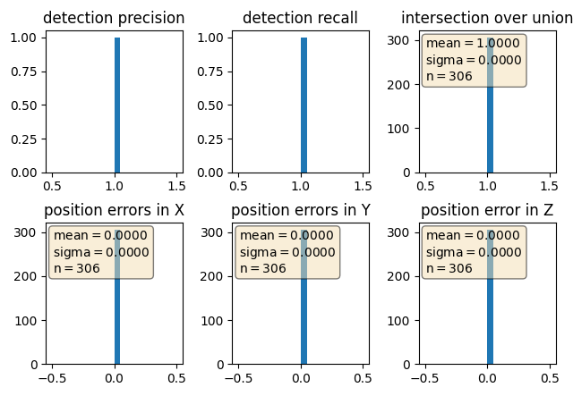

*Fig. 4.1.2: Plausibility check - 2D object detection performance in bird's eye view image using ground truth objects instead of object detections over frame IDs 50 ... 150, what should result in precision = 1.0 and recall = 1.0 if theare are no obvious bugs in the code.*

Figure 4.1.1 shows the 2D object detection performance evaluation results in bird's eye view image using fpn_resnet on frame 50 to 150. In order to plausibilize if the code produces reasonable results the experiment is repeated by setting 'configs_det.use_labels_as_objects = True', what makes the program use ground truth objects instead of object detections from a DNN model. This should result in 'precision = 1.0, recall = 1.0' if there are no obvious bugs. This is check is passed here as can be seedn from figure 4.1.2.

## Final Project: 3D Object Tracking over Time
The Final Project focuses on 3D object tracking (incl. height information) over time using camera and lidar sensor fusion via an extended Kalman filter (EKF). By evaluating the range, bearing and intensity information from the first order lidar response one can obtain range images (frontal projection) or a birds eye view (BEV) map of the lidar points. The bird's eye view map is fed to an object detector, which has been trained to detect object bounding boxes in such BEV projections yielding bounding box x-y-position, orientation angle, length and width. The object height can be obtained from the z-coordinates of the top-most lidar points within an object bounding box in a bev-map. The following documentation shows example plots generated by the implemented visualization functions in the code.

### Step 1: Single Target Object Tracking using an Extended Kalman Filter
In step 2, an Extended Kalman Filter (EKF) is implemented using a simple constant velocity model for target objects, or target vehicles, respectively. As its name says, the constant velocity model assumes rigit body motion with a constant velocity vector from one time step to another. This is a very simple assumption of true target object or target vehicle behavior, but it works for many cases well. As we use test sequences where the target objects move more or less in parallel to the ego vehicle this model is sufficient for this project. If target objects showed more complex motion behavior a more complex inner motion model ("bicicyle model"), which depicts realistic target object behavior better than the simple constand velocity model, would improve tracking behavior to some extend. The EKF allows variable time steps and corrects the prediction based on the inner process model of the target object's motion if a new measurement update occurs. In step 1, the EKF is initialized using fixed initial values, and measurement updates are generated only from lidar 3D object detections (or from 3D ground truth bounding boxes if configured). For lidar measurements, we have a linear measurement function h(x), and thus, a constant Jacobian H of h(x) at current state x. Later in step 4 of the Final Project, the EKF is extended by a non-linear measurement function h(x) for the camera and a respective Jacobian H of h(x) at current state x, too.

A description of all required steps can be found in the code involving the following files:
- [filter.py](student/filter.py): actual implementation of the extended Kalman filter
- [misc/params.py](misc/params.py): Kalman filter parameters
- [student/trackmanagement.py](student/trackmanagement.py): prediction step for state x and state estimation error covariance matrix P
- [student/measurement.py](student/measurement.py): measurement update based on a linear measurement function h and the respective Jacobian H

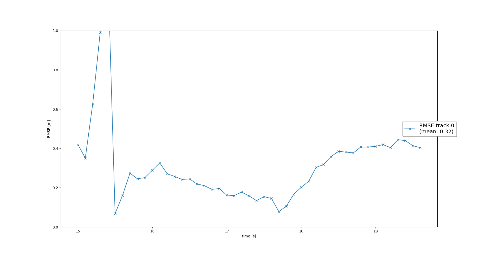

*Fig. 5.1.1: Tracking of a single target object over time on sequence 2 (10072231702153043603_5725_000_5745_000) frame ids 150...200 using an extended Kalman filter with a constant velocity model as inner model to represent target object motion behavior.*

*Fig. 5.1.2: Final pose of the tracked object at frame id 200 of sequences 2 (10072231702153043603_5725_000_5745_000).*

### Step 2: Track Management
In step 2 a simple and straight forward track management is implemented. All valid tracks are kept in a track list. For each target object, an individual EKF is assigned and initialized. If tracks are unassigned, because no more associated measurements come in, their socres are incrementally decreased. If a track score falls below a certain threshold or if the state estimation covariance matrix P of the EKF associated with the respective target object gets too big (e.g. if there are no more measurement updates associated with the track) the unassigned object track is deleted, or removed from track list, respectively.
New tracks are marked as 'initialized' upon first object detection. Afterwards, the track score for an existing input track is automatically increased if further measurement updates come in that can be associated with the respective track. Depending on the total track score the track state may change from 'initialized', to 'tentative', and then to 'confirmed', or back.

A description of all required steps can be found in the code, s. [./student/trackmanagement.py](./student/trackmanagement.py)

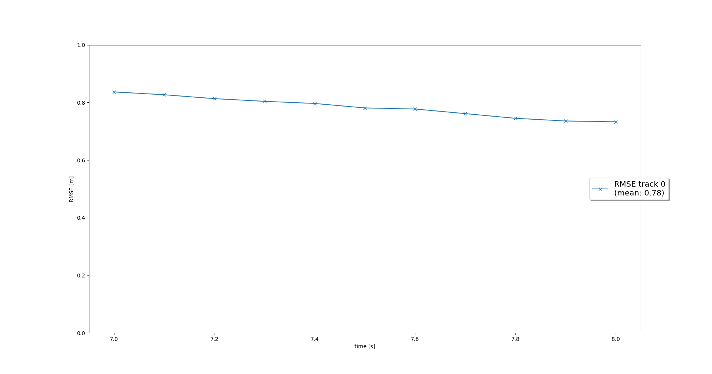

*Fig. 5.2.1: Results of single-object track management on sequence 2 (10072231702153043603_5725_000_5745_000) frame ids 65...100.*

Tracking single objects works as follows: After applying the track management to a new sequence (see instructions), the visualization shows that a new track is initialized automatically where unassigned measurements occur. The status of the track changes to 'tentative' if another measurement is associated with this track. The track is confirmed quickly if further incoming measurements are associated with it. It is deleted again after the tracked object has vanished from the visible range of the respective sensor. Fig. 5.2.1 shows one single track without track losses between the frames 65 to 100 of sequence 2. So single-object track management works as required.

### Step 3: Object Association of Tracks and Measurements
In step 3, [single nearest neighbor (SNN) track-measurement-association](https://stonesoup.readthedocs.io/en/latest/auto_tutorials/05_DataAssociation-Clutter.html) is implemented based on minimizing Mahalanobis distance of object detections (measurements) to tracks. It tries to associate measurements with a minimum Mahalanobis distance to specific track. Gating is applied consequently prior to track-measurement-association as a coarse test in order to prevent a pairing of unlikely track-measurement-combinations. Therefore, a gating limit is build around each measurement, which is compared with the respective Mahalanobis distance to the tracks. Only measurements with tracks inside the gating limits are considered for further association with the tracks, or for a track update, respectively. The remaining likley combinations of track-measurement-associations are kept in an association matrix holding the respective Mahalnobis distances of all yet unassigned measurements and tracks. The minimum entries of the association matrix mark the best measurement-track-pairing according to the suboptimal nearest neightbour association hypothesis, which may not always be correct - especially in dense traffic situations when multiple objects are very close or occlude one another. The track and measurement (object detection) of the minium entry of the assication matrix are mapped to one another. After the track has been updated with the measurement of the minimum entry, the respective row (track) and column (measurement) of the assiciation matrix are removed. This procedure is repeated iteratively until there are no more measurements and tracks to be associated.
For the remaining unassociated measurements, a new EKF track is initialized. The track scores of all remaining EKF-tracks without any measurement update are decremented.

A description of all required steps can be found in the code, s. [student/association.py]

*Fig. 5.3.1: Tracking of multiple target objects over time on sequence 1 (1005081002024129653_5313_150_5333_150) for the frame ids 0...198 using extended Kalman filters with gating and single nearest neighbor track-measurement association based on smallest Mahalanobis distance.*

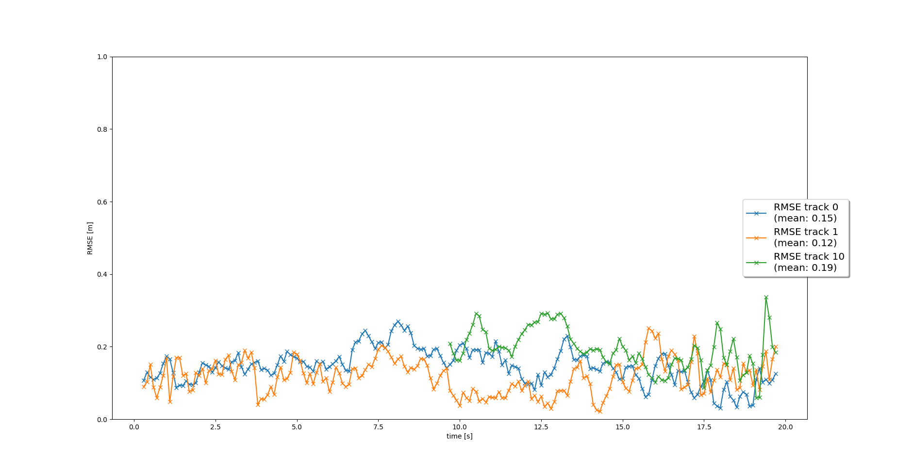

*Fig. 5.3.2: Final poses of the tracked objects at frame id 198 of sequence 1 (1005081002024129653_5313_150_5333_150).*

Fig. 5.3.1 shows multi-tracking results over time on sequence 1 for the frame ids 0...198. New objects appearing within the visible range are associated with the new track. Multiple tracks are updated iteratively with new measurements coming in. Fig. 5.3.2 shows the final pose with three tracked objets.

The most difficult part of multi-target-tracking is the correct association of new measurements with existing object tracks in conflict situations. Conflict situations arise when multiple measurements (object detections) fall within a single gate, or when a single measurement falls within the gates of more than one target object track. Such ambiguous situations occur when multiple target objects are very close to one another crossing each others paths or when multiple target objects (partially) occlude one another. Such complex scenararios can likely to be encountered in real-life urban traffic situations where multple different traffic participants meet oin larger numbers at one place. In such situations there are usually multiple potential causes from which tracking errors may originate. Besides pure association errors of different nearby or partially or mutually occluded objects, we also need to take false positive or false negative detections of the respective object detectors into account, which can be very hard to detect online.

Handling such non-trivial track-measurement-association tasks usually requires more sophisticated algorithms that are able to handle multiple track-measurement-association hypothesis at the same time also taking e.g. visual object properties like keypoint similarities, object sizes, object contours or even object behavior models into account. It also may help if the target objects can be observed from multiple perspectives with redundant sensors to make better decisions which measurement should be associated with which track. However, taking further target object properties besides probabilistic distances measurements into acount also leads to higher computational demands. In general, a reasonable compromise is needed in practice depending on the available computational resources.

As an alternative, [global nearest neighbor (GNN) track-measurement association](https://stonesoup.readthedocs.io/en/latest/auto_tutorials/06_DataAssociation-MultiTargetTutorial.html) is implemented in this project, too. It is also a single-hypothesis track association method, which tries to find the globally optimal combination of all possible track-measurement associations within the gating limit that yields a minimum overall sum of Mahalanobis distances. Neglecting reduction of possible constellations to be considered due to gating, we have a computationally very costly problem with a computational complexity of O(n!) if we used a brute force approach to solve it. For such kind of problems to find the lowest-cost way to assign n jobs to n workers, we can use the [Hungarian Algorithm](https://en.wikipedia.org/wiki/Hungarian_algorithm). James Munkres could show that the original Hungarian algorithm behaves strictly polynomial with a complexity of O(n⁴). Therefore, it is also called Kuhn-Munkres algorithms. There was another optimization of the Kuhn-Munkres algorithm, which only has a complexity of O(n³). There exists a python package with an implementation of the [munkres algorithm](https://pypi.org/project/munkres3/), which has been used in this project, too.

### Step 4: Completion of Camera-Lidar Sensor Fusion
In step 4, the restriction to use Lidar measurements only is removed, and sensor fusion is extended to using lidar and camera measurements alternatively. As this final part of the project focuses only on the sensor fusion part and not on object detection as such, object position measurements are simulated using ground truth object labels instead of predictions generated by trained object detectors for the sake of simplification and reduction of processing time. Measurement noise is added to the simulated measurements to make them more real-like. Only for the lidar sensor, a 3D object detector is implemented as a non-optimized example in the mid-term part of this project. It can be activated by configuration. As the camera measurements are not taken from an object detector but from ground truth object labels in vehicle coordinates, a nonlinear measurement function needs to be implemented, which transforms the ground truth object position into the camera coordinate system and then to pixel coordinates.

For sensor fusion of measurements from different sensors, their respective fields of view and their overlap needs to be considered. The top lidar sensor and the front camera have quite different fields of view (fov). Only a small part of the 360° surround view of the top lidar sensor overlaps with the front camera's fov, and thus, with some tolerance, can indeed be used for sensor fusion. For the top lidar sensor a usable fov of [-pi/2, +pi/2] or [-1.57, +1.57] radians is defined, whereas the usable fov of the front camera is limited to [-0.35, +0.35] radians, which is much smaller than the defined limits of the lidar fov. In order to remove measurements outside the relevant fov range prior to sensor fusion, track-measurement-association is extended by an additional function that checks if a detected object (measurement) is visible within the defined usable fov of the respective sensor. Measurements outside fov are ignored. It can be applied for both lidar or camera measurements.

This implementation results in the multi-target-tracking results shown in the following. Fig. 5.4.1 shows the multi-target-tracking results on sequence 1 for the frame ids 0...198). In fig. 5.4.2 you can see the final poses of the tracket target objects at frame 198 of sequence 1. In fig. 5.4.3 you can see a video of the tracking process using default values for the EKF parameters.

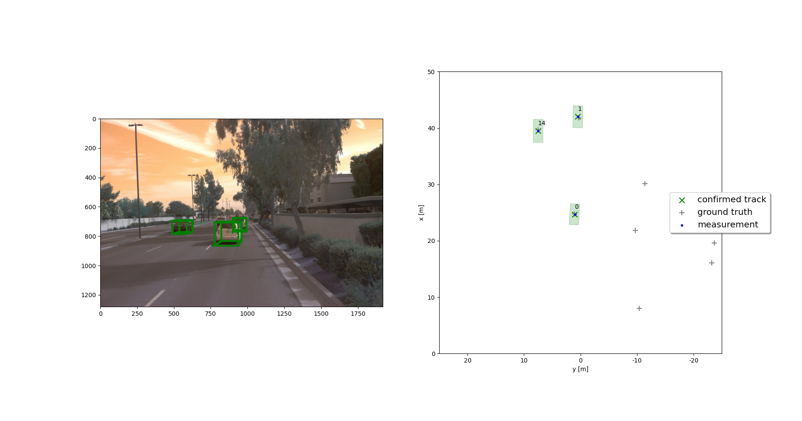

*Fig. 5.4.1: Tracking of multiple target objects over time on sequence 1 (1005081002024129653_5313_150_5333_150) for the frame ids 0...198 using extended Kalman filters and camera-lidar sensor fusion with gating and single nearest neighbor association based on smallest Mahalanobis distance.*

*Fig. 5.4.2: Final poses of multiple tracked object at frame 198 of sequence 1 (1005081002024129653_5313_150_5333_150), which partially occlude one another.*

*Fig. 5.4.3: Tracking video of multiple target objects over time on sequence 1 (1005081002024129653_5313_150_5333_150) for the frame ids 0...198 using extended Kalman filters and camera-lidar sensor fusion with gating and single nearest neighbor association based on smallest Mahalanobis distance.*

### Options for further Sensor Fusion and Multi-Target-Tracking
As already mentioned in the previous chapters there are several ways how to improve sensor fusion based on lidar and camera and multi-target tracking. However, a visible effect cannot be seen in any scenario. For instance, using a "bicycle model" instead of a constant velocity model only shows an effect if we have target object, which show more complex behavior with curves and lateral motion w.r.t. the ego vehicle. If we just have target objects moving in parallel to the ego vehicle it does not show advantages - just higher computational cost. Here is a summary what could be done:

- use a higher order inner model that represents true target motion much better than a constant velocity model (e.g. bicycle model)
- optimize Kalman filter parameters
- use a global hypothesis or a multi-hypothesis track-measurement association
- use additional features (e.g. keypoint similarity) to compare the properties of tracked target objects in the previous state(s) with the properties of the measured objects in the current frame

Remark: All these measures come with higher computational cost compared to a simple approach, but should improve the behavior noticably in ambiguous situations compared to the simple approach.
